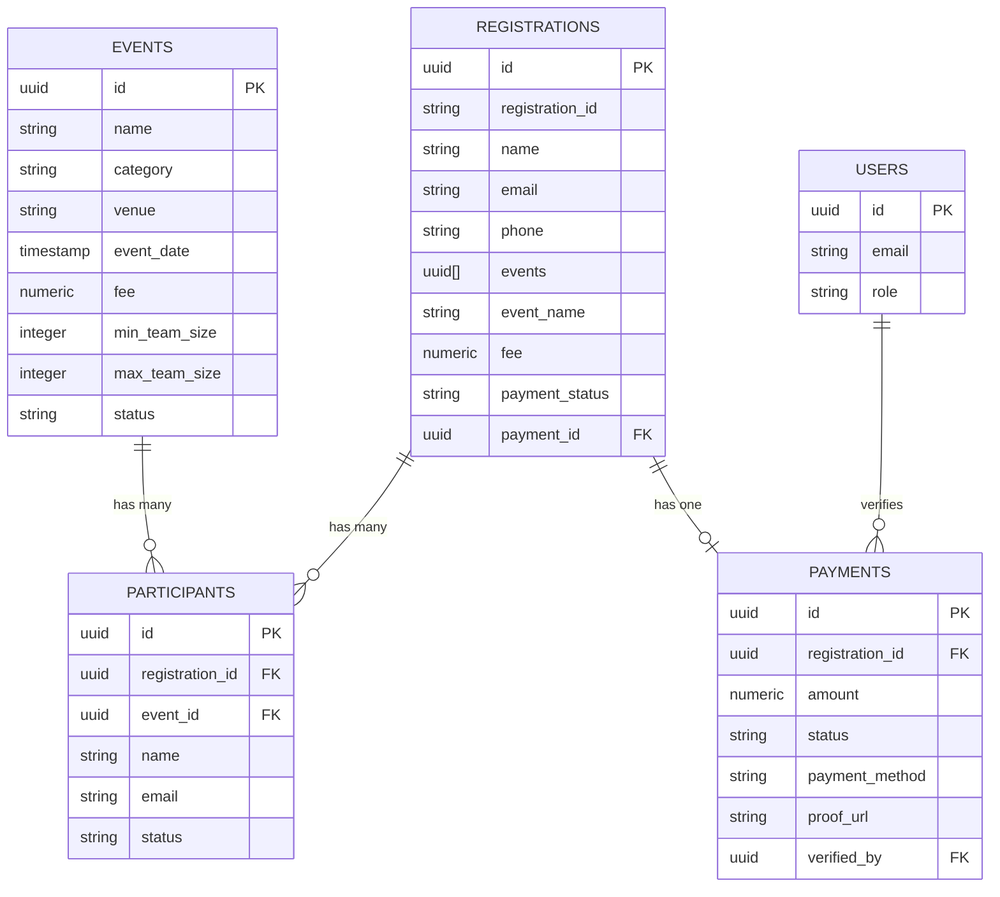

# Infinity 2025 - Database Schema

This document outlines the database schema and relationships for the Infinity 2025 event management system.

## Tables

### Events

Stores information about all events in the festival.

| Column | Type | Description |
|--------|------|-------------|
| id | UUID | Primary key |
| name | Text | Event name |
| description | Text | Detailed description |
| category | Text | 'tech' or 'cultural' |
| venue | Text | Event location |
| event_date | Timestamp | Date and time of event |
| fee | Numeric | Registration fee |
| min_team_size | Integer | Minimum team members |
| max_team_size | Integer | Maximum team members |
| status | Text | 'active', 'upcoming', 'completed', 'inactive' |
| created_at | Timestamp | Creation timestamp |
| updated_at | Timestamp | Last update timestamp |

### Registrations

Stores registration information for all participants.

| Column | Type | Description |
|--------|------|-------------|
| id | UUID | Primary key |
| registration_id | Text | Human-readable ID (INF-YYYY-XXXXX) |
| name | Text | Participant name |
| email | Text | Participant email |
| phone | Text | Participant phone number |
| university | Text | Participant's university |
| events | Array | Array of event IDs |
| event_name | Text | Comma-separated list of event names |
| fee | Numeric | Total fee for all events |
| payment_status | Text | 'pending', 'paid', 'rejected', 'awaiting_payment' |
| payment_id | UUID | Foreign key to payments table |
| team_name | Text | Name of team (if applicable) |
| team_members | JSON | Array of team member names |
| category | Text | 'tech' or 'cultural' (or 'mixed') |
| created_at | Timestamp | Creation timestamp |
| updated_at | Timestamp | Last update timestamp |

### Payments

Stores payment information for registrations.

| Column | Type | Description |
|--------|------|-------------|
| id | UUID | Primary key |
| registration_id | UUID | Foreign key to registrations table |
| amount | Numeric | Payment amount |
| currency | Text | Currency code (e.g., 'INR') |
| status | Text | 'pending', 'verified', 'rejected' |
| payment_method | Text | 'qr', 'cash', 'upi', etc. |
| proof_url | Text | URL to payment proof image |
| proof_path | Text | Storage path for payment proof |
| notes | Text | Additional notes/comments |
| verified_by | UUID | Admin who verified the payment |
| created_at | Timestamp | Creation timestamp |
| updated_at | Timestamp | Last update timestamp |

### Participants

Links registrations to specific events.

| Column | Type | Description |
|--------|------|-------------|
| id | UUID | Primary key |
| registration_id | UUID | Foreign key to registrations table |
| event_id | UUID | Foreign key to events table |
| name | Text | Participant name |
| email | Text | Participant email |
| status | Text | 'registered', 'attended', 'cancelled', 'no-show' |
| created_at | Timestamp | Creation timestamp |
| updated_at | Timestamp | Last update timestamp |

### Contact Messages

Stores messages from the contact form.

| Column | Type | Description |
|--------|------|-------------|
| id | UUID | Primary key |
| name | Text | Sender name |
| email | Text | Sender email |
| subject | Text | Message subject |
| message | Text | Message content |
| status | Text | 'unread', 'read', 'replied' |
| created_at | Timestamp | Creation timestamp |
| updated_at | Timestamp | Last update timestamp |

### Users (Auth)

Managed by Supabase Auth - stores admin user credentials.

## Database Relationships

## Storage Buckets

- **payment_proofs**: Stores payment proof images uploaded by users
- **event_images**: Stores event promotional images
- **profile_photos**: Stores admin user profile photos

## Indexing Strategy

- Primary keys (id) on all tables
- Indexes on registration_id for quick lookups
- Indexes on email fields for user searches
- Indexes on payment_status for filtering by status
- Composite indexes on (event_id, status) for event participant queries

## Row-Level Security (RLS) Policies

All tables have RLS policies restricting access:

1. Public users can only:
   - Read event information
   - Create their own registrations
   - Update their own registrations (before payment)
   
2. Authenticated admin users can:
   - Full CRUD on all tables
   - Only access users with appropriate role permissions
